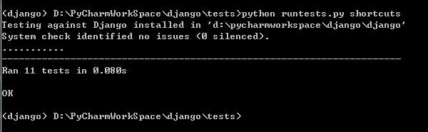

# 编写你的第一个 Django 补丁

## 这个指南涵盖哪些内容？

我们将指导你贡献你的第一个 Django 补丁，在本教程完毕时，你将对相关工具及流程有一个基本的认识。特别的，我们将覆盖以下内容：

-    安装 Git。
-    下载一份Django开发版的拷贝。
-    运行 Django 的测试套件。
-    为你的补丁写一个测试。
-    为你的补丁编写代码。
-    测试你的补丁。
-    提交一个 pull request（PR）。
-    在哪里查找更多的信息。

> 必须Python 3！
>> 目前的 Django 版本不再支持 Python 2.7。你可以在 Python 下载页 或通过操作系统的包管理器下载 Python 3。

## 代码规范

作为一个贡献者, 你可以帮助我们保持 Django 的社区开放性和包容性。请仔细阅读并遵守我们的 行为守则。

## 安装Git

在本教程中，你需要安装好 Git，用 Git 下载 Django 的最新开发版本并且为你的修改生成补丁文件。

## 获得一个 Django 开发版本的副本

为 Django 做贡献的第一步就是获取源代码副本。首先， fork Github 上的 Django 项目 <https://github.com/django/django/fork>。接下来，在命令行中，使用 cd 命令切换至某个你想存放 Django 源码的目录。

使用下面的命令来下载 Django 的源码库：

git clone https://github.com/YourGitHubName/django.git

> **低速宽带连接？**
>> 你可以在用命令 git clone 下载仓库的时候加上参数 --depth 1 来跳过 Django 的提交历史，这大约能把下载大小从250MB减少到70MB

你现在已经将Django拷贝到本地，可以像安装其他软件包一样使用 ``pip``进行安装。 最便捷的方式是通过 virtual environment， 这是 Python 的一个内置特性，它可以让你在一个目录中保持独立的软件包环境而不影响其他的项目。

进入准备创建虚拟环境的目录下，通过运行以下命令创建一个虚拟环境：  
`py -m venv django`

激活虚拟环境：

`D:\PythonVENV\Python36\django\Scripts\activate.bat`  

当前激活的虚拟环境的名称会被展示在命令行，这可以让你搞清楚你正在使用哪一个虚拟环境。

下一步安装之前克隆的 Django 副本,进入django副本目录：
`py -m pip install -e .`

## 首先运行 Django 的测试套件

运行测试套件之前，先 cd 进入 Django 的 tests/ 目录，安装其依赖，运行：

`(django) D:\PyCharmWorkSpace\django\tests>py -m pip install -r requirements\py3.txt`

现在你可以运行测试套件。

`./runtests.py

## 尝试搞定一项新功能

这次教程中，我们将学习去完成一个名叫 "fake ticket" 的例子。下面是关于这个例子的大体构想:

> Ticket #99999 -- 允许发表祝辞
>> Django中需要声明一个函数django.shortcuts.make_toast()，它的返回值为'toast'。

我们现在来实现这个新功能并且做一下相关的测试。

## 为你的补丁创建一个分支

在做出任何修改之前，为你的工单创建一个分支：

`git checkout -b ticket_99999`

## 为你的工单写一些测试用例

### 为你的工单编写代码

添加 make_toast() 函数,打开 django/ 文件夹中的 shortcuts.py 文件，在文件末尾追加:
```python
def make_toast():
    return 'toast'
```
### 为工单 #99999 写测试

为了解决这次的工单问题，我们将在最上层的 django 模块中添加一个函数 make_toast()。首先我们来写一个测试用例，用于测试该函数，并且验证一下它的输出项是否正确。

前往Django的 tests/shortcuts/ 文件夹，创建一个名为 test_make_toast.py 的新文件。添加如下代码:

```python
from django.shortcuts import make_toast
from django.test import SimpleTestCase


class MakeToastTests(SimpleTestCase):
    def test_make_toast(self):
        self.assertEqual(make_toast(), 'toast')
```

上述测试是用来检测 make_toast() 函数是否会返回 ``'toast'` `的。

### 运行你的新测试

使用 cd 命令进入Django的 tests/ 文件夹，然后运行:
`python runtests.py shortcuts`

正常通过测试:



## 书写文档

这是一项新功能，所以应该为它建立一个说明，打开文件 docs/topics/http/shortcuts.txt ，然后在文件末尾追加下记内容:

```text
``make_toast()``
================

.. versionadded:: 2.2

Returns ``'toast'``.
```

由于这一新功能将在即将到来的版本中被加入，所以下个版本的发布说明里也加入了相关内容。打开 docs/releases/2.2.txt 文件，即发布说明的最新版本文件，在小标题"Minor Features"下面添加一个说明:

```text
:mod:`django.shortcuts`
~~~~~~~~~~~~~~~~~~~~~~~

* The new :func:`django.shortcuts.make_toast` function returns ``'toast'``.
```

## 预览你的修改

现在是时候完成我们这个分支的所有变更，准备将它们提交了，执行:

`git status`

```text
$ git status
On branch ticket_99999
Changes not staged for commit:
  (use "git add <file>..." to update what will be committed)
  (use "git restore <file>..." to discard changes in working directory)
        modified:   django/shortcuts.py
        modified:   docs/releases/2.2.txt
        modified:   docs/topics/http/shortcuts.txt

Untracked files:
  (use "git add <file>..." to include in what will be committed)
        tests/shortcuts/test_make_toast.py

no changes added to commit (use "git add" and/or "git commit -a")

```

## 提交补丁中的修改

```text
qiaoyafeng@qiaoyafeng-PC MINGW64 /d/PyCharmWorkSpace/django (ticket_99999)
$ git add .
warning: LF will be replaced by CRLF in django/shortcuts.py.
The file will have its original line endings in your working directory
warning: LF will be replaced by CRLF in docs/releases/2.2.txt.
The file will have its original line endings in your working directory
warning: LF will be replaced by CRLF in docs/topics/http/shortcuts.txt.
The file will have its original line endings in your working directory
warning: LF will be replaced by CRLF in tests/shortcuts/test_make_toast.py.
The file will have its original line endings in your working directory

qiaoyafeng@qiaoyafeng-PC MINGW64 /d/PyCharmWorkSpace/django (ticket_99999)
$ git commit
[ticket_99999 501143cb98] Fixed #99999 -- Added a shortcut function to make toast.
 4 files changed, 25 insertions(+)
 create mode 100644 tests/shortcuts/test_make_toast.py

qiaoyafeng@qiaoyafeng-PC MINGW64 /d/PyCharmWorkSpace/django (ticket_99999)

```

## 推送这次提交并生成一个 pull 请求

在提交这次的修改之后，将其发送到你在GitHub上的分支(如果你使用的名称不是"ticket_99999"，用你自己的分支的名称取代它 ):

```text
qiaoyafeng@qiaoyafeng-PC MINGW64 /d/PyCharmWorkSpace/django (ticket_99999)
$ git push origin ticket_99999
Enter passphrase for key '/c/Users/qiaoyafeng/.ssh/id_rsa':
Enumerating objects: 24, done.
Counting objects: 100% (24/24), done.
Delta compression using up to 4 threads
Compressing objects: 100% (13/13), done.
Writing objects: 100% (13/13), 1.22 KiB | 624.00 KiB/s, done.
Total 13 (delta 11), reused 0 (delta 0)
remote: Resolving deltas: 100% (11/11), completed with 11 local objects.
remote:
remote: Create a pull request for 'ticket_99999' on GitHub by visiting:
remote:      https://github.com/qiaoyafeng/django/pull/new/ticket_99999
remote:
To github.com:qiaoyafeng/django.git
 * [new branch]            ticket_99999 -> ticket_99999

qiaoyafeng@qiaoyafeng-PC MINGW64 /d/PyCharmWorkSpace/django (ticket_99999)

```

你可以访问 Django GitHub page 创建一个 pull 请求。 你会在“你最近推送的分支”下看到你的分支。 单击旁边的 "Compare & pull request"。

本教程中请不要这么做。不过，在接下来显示补丁预览的页面，你可以单击 "Create pull request"。

