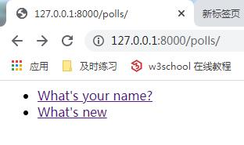
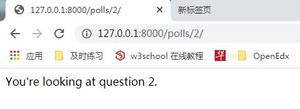

# 编写你的第一个 Django 应用，第 3 部分


## 概况
 
Django 中的视图的概念是「一类具有相同功能和模板的网页的集合」。比如，在一个博客应用中，你可能会创建如下几个视图：

- 博客首页——展示最近的几项内容。
- 内容“详情”页——详细展示某项内容。
- 以年为单位的归档页——展示选中的年份里各个月份创建的内容。
- 以月为单位的归档页——展示选中的月份里各天创建的内容。
- 以天为单位的归档页——展示选中天里创建的所有内容。
- 评论处理器——用于响应为一项内容添加评论的操作。

而在我们的投票应用中，我们需要下列几个视图：

- 问题索引页——展示最近的几个投票问题。
- 问题详情页——展示某个投票的问题和不带结果的选项列表。
- 问题结果页——展示某个投票的结果。
- 投票处理器——用于响应用户为某个问题的特定选项投票的操作。


为了将 URL 和视图关联起来，Django 使用了 'URLconfs' 来配置。URLconf 将 URL 模式映射到视图。

## 编写更多视图

现在让我们向 polls/views.py 里添加更多视图。这些视图有一些不同，因为他们接收参数：

```python

from django.http import HttpResponse


def index(request):
    return HttpResponse("Hello,World. You're at the polls index.")


def detail(request, question_id):
    return HttpResponse("You're looking at question %s." % question_id)


def results(request, question_id):
    response = "You're looking at the results of question %s."
    return HttpResponse(response % question_id)


def vote(request, question_id):
    return HttpResponse("You're voting on question %s." % question_id)


```

把这些新视图添加进 polls.urls 模块里，只要添加几个 url() 函数调用就行：

```python

from  django.urls import path

from . import views

urlpatterns = [
    # ex: /polls/
    path('', views.index, name='index'),
    # ex: /polls/5/
    path('<int:question_id>/', views.detail, name='detail'),
    # ex: /polls/5/results/
    path('<int:question_id>/results/', views.results, name='result'),
    # ex: /polls/5/vote/
    path('<int:question_id>/vote/', views.vote, name='vote'),
]

```
当某人请求你网站的某一页面时——比如说， "/polls/34/" ，Django 将会载入 mysite.urls 模块，因为这在配置项 ROOT_URLCONF 中设置了。然后 Django 寻找名为 urlpatterns 变量并且按序匹配正则表达式。在找到匹配项 'polls/'，它切掉了匹配的文本（"polls/"），将剩余文本——"34/"，发送至 'polls.urls' URLconf 做进一步处理。在这里剩余文本匹配了 '<int:question_id>/'，使得我们 Django 以如下形式调用 detail():

`detail(request=<HttpRequest object>, question_id=34)`

question_id=34 由 <int:question_id> 匹配生成。使用尖括号“捕获”这部分 URL，且以关键字参数的形式发送给视图函数。上述字符串的 :question_id> 部分定义了将被用于区分匹配模式的变量名，而 int: 则是一个转换器决定了应该以什么变量类型匹配这部分的 URL 路径。

## 写一个真正有用的视图

每个视图必须要做的只有两件事：返回一个包含被请求页面内容的 HttpResponse 对象，或者抛出一个异常，比如 Http404 。至于你还想干些什么，随便你。
  
Django 只要求返回的是一个 HttpResponse ，或者抛出一个异常。

在 index() 函数里插入了一些新内容，让它能展示数据库里以发布日期排序的最近 5 个投票问题，以空格分割：

```python

from .models import Question

def index(request):
    latest_question_list = Question.objects.order_by('-pub_date')[:5]
    output = ', '.join([q.question_text for q in latest_question_list])
    return HttpResponse(output)

```

这里有个问题：页面的设计写死在视图函数的代码里的。如果你想改变页面的样子，你需要编辑 Python 代码。所以让我们使用 Django 的模板系统，只要创建一个视图，就可以将页面的设计从代码中分离出来。

首先，在你的 polls 目录里创建一个 templates 目录。Django 将会在这个目录里查找模板文件。

你项目的 TEMPLATES 配置项描述了 Django 如何载入和渲染模板。默认的设置文件设置了 DjangoTemplates 后端，并将 APP_DIRS 设置成了 True。这一选项将会让 DjangoTemplates 在每个 INSTALLED_APPS 文件夹中寻找 "templates" 子目录。这就是为什么尽管我们没有像在第二部分中那样修改 DIRS 设置，Django 也能正确找到 polls 的模板位置的原因。  

在你刚刚创建的 templates 目录里，再创建一个目录 polls，然后在其中新建一个文件 index.html 。换句话说，你的模板文件的路径应该是 polls/templates/polls/index.html 。因为 Django 会寻找到对应的 app_directories ，所以你只需要使用 polls/index.html 就可以引用到这一模板了。  

> **模板命名空间**
>> 虽然我们现在可以将模板文件直接放在 polls/templates 文件夹中（而不是再建立一个 polls 子文件夹），但是这样做不太好。Django 将会选择第一个匹配的模板文件，如果你有一个模板文件正好和另一个应用中的某个模板文件重名，Django 没有办法 区分 它们。我们需要帮助 Django 选择正确的模板，最简单的方法就是把他们放入各自的 命名空间 中，也就是把这些模板放入一个和 自身 应用重名的子文件夹里。

将下面的代码输入到刚刚创建的模板文件中：

polls/templates/polls/index.html

```html


    <ul>
    
        <li><a href="/polls/{{ question.id }}/">{{ question.question_text }}</a></li>
    
    </ul>

    <p>No polls are available.</p>


```

然后，让我们更新一下 polls/views.py 里的 index 视图来使用模板：

polls/views.py

```python

from django.http import HttpResponse
from django.template import loader

from .models import Question


def index(request):
    latest_question_list = Question.objects.order_by('-pub_date')[:5]
    template = loader.get_template('polls/index.html')
    context = {
        'latest_question_list': latest_question_list,
    }
    return HttpResponse(template.render(context,request))


```

上述代码的作用是，载入 polls/index.html 模板文件，并且向它传递一个上下文(context)。这个上下文是一个字典，它将模板内的变量映射为 Python 对象。  

用你的浏览器访问 "/polls/" ，你将会看见一个无序列表，链接指向这个投票的详情页。

列表：  


详情：  



## 一个快捷函数： render()
「载入模板，填充上下文，再返回由它生成的 HttpResponse 对象」是一个非常常用的操作流程。于是 Django 提供了一个快捷函数，我们用它来重写 index() 视图：

 polls/views.py
```python
from django.shortcuts import render

from .models import Question

def index(request):
    latest_question_list = Question.objects.order_by('-pub_date')[:5]
    context = {
        'latest_question_list': latest_question_list,
    }
    return render(request, 'polls/index.html', context)

```

注意到，我们不再需要导入 loader 和 HttpResponse 。不过如果你还有其他函数（比如说 detail, results, 和 vote ）需要用到它的话，就需要保持 HttpResponse 的导入。  

## 抛出 404 错误

现在，我们来处理投票详情视图——它会显示指定投票的问题标题。下面是这个视图的代码：

polls/views.py
```python

from django.http import Http404
from django.shortcuts import render

from .models import Question


def detail(request, question_id):
    try:
        question = Question.objects.get(pk=question_id)
    except Question.DoesNotExist:
        raise Http404("Question does not exist")
    return render(request, 'polls/detail.html', {'question': question})

```

这里有个新原则。如果指定问题 ID 所对应的问题不存在，这个视图就会抛出一个 Http404 异常。

需要在 polls/detail.html 里输入什么，但是如果你想试试上面这段代码是否正常工作的话，你可以暂时把下面这段输进去：

polls/templates/polls/detail.html
```html
{{ question }}
```

## 一个快捷函数： get_object_or_404()
