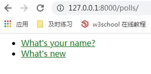

# 编写你的第一个 Django 应用，第 6 部分

这一篇从 [教程第 5 部分](tutorial05.md) 结尾的地方继续讲起。在上一节中我们为网络投票应用编写了测试，而现在我们要为它加上样式和图片。

除了服务端生成的 HTML 以外，网络应用通常需要一些额外的文件——比如图片，脚本和样式表——来帮助渲染网络页面。在 Django 中，我们把这些文件统称为“静态文件”。

django.contrib.staticfiles 它将各个应用的静态文件（和一些你指明的目录里的文件）统一收集起来，这样一来，在生产环境中，这些文件就会集中在一个便于分发的地方。

## 自定义 应用 的界面和风格

首先，在你的 polls 目录下创建一个名为 static 的目录。Django 将在该目录下查找静态文件，这种方式和 Diango 在 polls/templates/ 目录下查找 template 的方式类似。

在你刚创建的 static 文件夹中创建一个名为 polls 的文件夹，再在 polls 文件夹中创建一个名为 style.css 的文件。换句话说，你的样式表路径应是 polls/static/polls/style.css。因为 AppDirectoriesFinder 的存在，你可以在 Django 中简单地使用以 polls/style.css 的形式引用此文件，类似你引用模板路径的方式。

> **静态文件命名空间**
>> 虽然我们 可以 像管理模板文件一样，把 static 文件直接放入 polls/static ——而不是创建另一个名为 polls 的子文件夹，不过这实际上是一个很蠢的做法。Django 只会使用第一个找到的静态文件。如果你在 其它 应用中有一个相同名字的静态文件，Django 将无法区分它们。我们需要指引 Django 选择正确的静态文件，而最简单的方式就是把它们放入各自的 命名空间 。也就是把这些静态文件放入 另一个 与应用名相同的目录中。

将以下代码放入样式表(polls/static/polls/style.css)：
```css
li a {
    color: green;
}
```
下一步，在 polls/templates/polls/index.html 的文件头添加以下内容：

```html


<link rel="stylesheet" type="text/css" href="">
```

 模板标签会生成静态文件的绝对路径。

新载入``http://localhost:8000/polls/`` ，你会发现有问题的链接是绿色的 (这是Django自己的问题标注方式) ，这意味着你追加的样式表起作用了。




## 接下来要做什么？

当你熟悉静态文件后，阅读[教程的第 7 部分](tutorial07.md)  来学习如何自定义 Django 自动生成后台网页的过程。