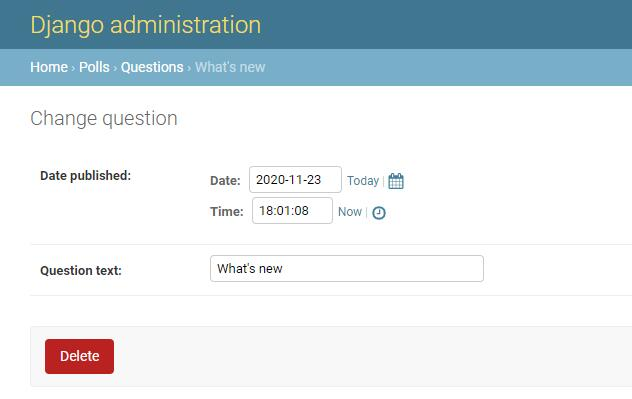
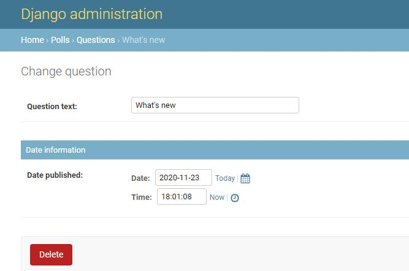

# 编写你的第一个 Django 应用，第 7 部分

这篇教程承接 [教程第 6 部分](tutorial06.md)  结束的地方。我们继续修改在线投票应用，这次我们专注于自定义我们在 [教程第 2 部分](tutorial02.md)  初见过的 Django 自动生成后台的过程。


## 自定义后台表单

通过 admin.site.register(Question) 注册 Question 模型，Django 能够构建一个默认的表单用于展示。

让我们通过重排列表单上的字段来看看它是怎么工作的。用以下内容替换 admin.site.register(Question)：  
polls/admin.py
```python
from django.contrib import admin

from .models import Question


class QuestionAdmin(admin.ModelAdmin):
    fields = ['pub_date', 'question_text']


admin.site.register(Question,QuestionAdmin)

```
以上修改使得 "Publication date" 字段显示在 "Question" 字段之前：


你可能更期望将表单分为几个字段集：
```python
from django.contrib import admin

from .models import Question


class QuestionAdmin(admin.ModelAdmin):
    fieldsets = [
        (None, {'fields': ['question_text']}),
        ('Date information', {'fields': ['pub_date']}),
    ]


admin.site.register(Question, QuestionAdmin)

```

fieldsets 元组中的第一个元素是字段集的标题。以下是我们的表单现在的样子：



## 接下来要做什么？

当你熟悉静态文件后，阅读[教程的第 7 部分](tutorial07.md)  来学习如何自定义 Django 自动生成后台网页的过程。