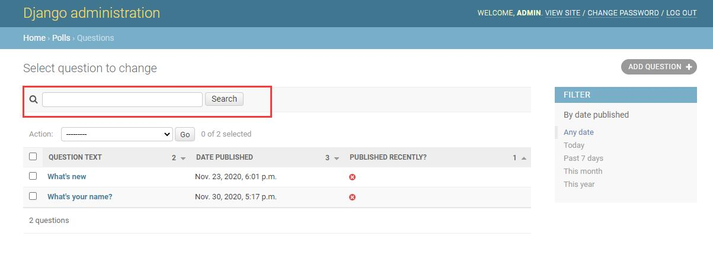
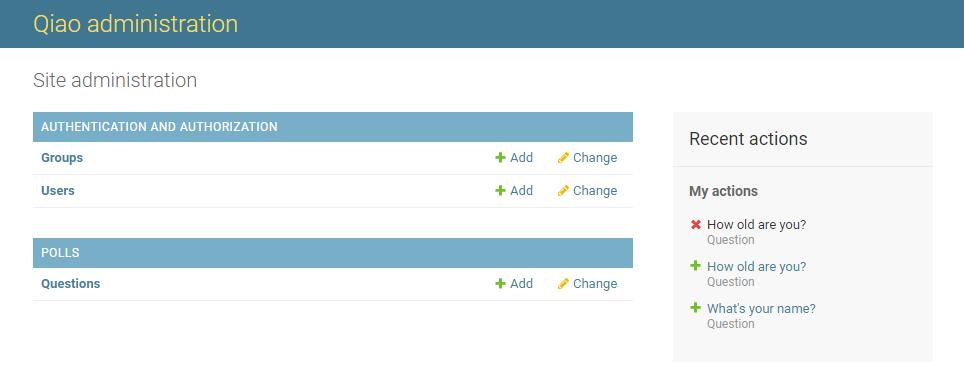

# 编写你的第一个 Django 应用，第 7 部分

这篇教程承接 [教程第 6 部分](tutorial06.md)  结束的地方。我们继续修改在线投票应用，这次我们专注于自定义我们在 [教程第 2 部分](tutorial02.md)  初见过的 Django 自动生成后台的过程。


## 自定义后台表单

通过 admin.site.register(Question) 注册 Question 模型，Django 能够构建一个默认的表单用于展示。

让我们通过重排列表单上的字段来看看它是怎么工作的。用以下内容替换 admin.site.register(Question)：  
polls/admin.py
```python
from django.contrib import admin

from .models import Question


class QuestionAdmin(admin.ModelAdmin):
    fields = ['pub_date', 'question_text']


admin.site.register(Question,QuestionAdmin)

```
以上修改使得 "Publication date" 字段显示在 "Question" 字段之前：  


你可能更期望将表单分为几个字段集：
```python
from django.contrib import admin

from .models import Question


class QuestionAdmin(admin.ModelAdmin):
    fieldsets = [
        (None, {'fields': ['question_text']}),
        ('Date information', {'fields': ['pub_date']}),
    ]


admin.site.register(Question, QuestionAdmin)

```

fieldsets 元组中的第一个元素是字段集的标题。以下是我们的表单现在的样子：  


## 添加关联的对象

一个 Question 有多个 Choice，但后台页却没有显示多个选项。

有两个方法可以解决这个问题。第一个就是仿照我们向后台注册 Question 一样注册 Choice 。这很简单：
polls/admin.py
```python
from django.contrib import admin

from .models import Question, Choice


class QuestionAdmin(admin.ModelAdmin):
    fieldsets = [
        (None, {'fields': ['question_text']}),
        ('Date information', {'fields': ['pub_date']}),
    ]


admin.site.register(Question, QuestionAdmin)
admin.site.register(Choice)

```

现在 "Choices" 在 Django 后台页中是一个可用的选项了。“添加选项”的表单看起来像这样：


这是一种很低效地添加“选项”的方法。更好的办法是在你创建“投票”对象时直接添加好几个选项。让我们实现它。

移除调用 register() 注册 Choice 模型的代码。随后，像这样修改 Question 的注册代码：

polls/admin.py

```python
from django.contrib import admin

from .models import Choice, Question


class ChoiceInline(admin.TabularInline):
    model = Choice
    extra = 3


class QuestionAdmin(admin.ModelAdmin):
    fieldsets = [
        (None, {'fields': ['question_text']}),
        ('Date information', {'fields': ['pub_date']}),
    ]
    inlines = [ChoiceInline]


admin.site.register(Question, QuestionAdmin)
```


它看起来像这样：有三个关联的选项插槽——由 extra 定义，且每次你返回任意已创建的对象的“修改”页面时，你会见到三个新的插槽。

## 自定义后台更改列表

让我们对“问题列表”页面进行一些调整——改成一个能展示系统中所有投票的页面。

以下是它此时的外观：  


默认情况下，Django 显示每个对象的 str() 返回的值。但有时如果我们能够显示多个字段，它会更有帮助。为此，使用 list_display 后台选项，它是一个包含要显示的字段名的元组，在更改列表页中以列的形式展示这个对象：
```python
class QuestionAdmin(admin.ModelAdmin):
    list_display = ('question_text', 'pub_date')
```


为了更好用，让我们也包含  was_published_recently() 方法：
```python
class QuestionAdmin(admin.ModelAdmin):
    list_display = ('question_text', 'pub_date', 'was_published_recently')
```


你可以点击列标题来对这些行进行排序——除了 was_published_recently 这个列，因为没有实现排序方法。顺便看下这个列的标题 was_published_recently，默认就是方法名（用空格替换下划线），该列的每行都以字符串形式展示出处。

你可以通过给这个方法（在 polls/models.py 中）一些属性来达到优化的目的，像这样：

```python
    def was_published_recently(self):
        return timezone.now() >= self.pub_date >= timezone.now() - datetime.timedelta(days=1)
    was_published_recently.admin_order_field = 'pub_date'
    was_published_recently.boolean = True
    was_published_recently.short_description = 'Published recently?'
```

再次编辑文件 polls/admin.py，优化 Question 变更页：过滤器，使用 list_filter。将以下代码添加至 QuestionAdmin：

```python
list_filter = ['pub_date']
```

这样做添加了一个“过滤器”侧边栏，允许人们以 pub_date 字段来过滤列表：


展示的过滤器类型取决你你要过滤的字段的类型。因为 pub_date 是类 DateTimeField，Django 知道要提供哪个过滤器：“任意时间”，“今天”，“过去7天”，“这个月”和“今年”。

这已经弄的很好了。让我们再扩充些功能:

```python
search_fields = ['question_text']
```

在列表的顶部增加一个搜索框。当输入待搜项时，Django 将搜索 question_text 字段。你可以使用任意多的字段——由于后台使用 LIKE 来查询数据，将待搜索的字段数限制为一个不会出问题大小，会便于数据库进行查询操作。




## 自定义后台界面和风格
在每个后台页顶部显示“Django 管理员”显得很滑稽。这只是一串占位文本。
### 自定义你的 工程的 模板

在你的工程目录（指包含 manage.py 的那个文件夹）内创建一个名为 templates 的目录。模板可放在你系统中任何 Django 能找到的位置。（谁启动了 Django，Django 就以他的用户身份运行。）不过，把你的模板放在工程内会带来很大便利，推荐你这样做。

打开你的设置文件（mysite/settings.py，牢记），在 TEMPLATES 设置中添加 DIRS 选项：

```python
TEMPLATES = [
    {
        'BACKEND': 'django.template.backends.django.DjangoTemplates',
        'DIRS': [os.path.join(BASE_DIR, 'templates')],
        'APP_DIRS': True,
        'OPTIONS': {
            'context_processors': [
                'django.template.context_processors.debug',
                'django.template.context_processors.request',
                'django.contrib.auth.context_processors.auth',
                'django.contrib.messages.context_processors.messages',
            ],
        },
    },
]
```
DIRS 是一个包含多个系统目录的文件列表，用于在载入 Django 模板时使用，是一个待搜索路径。

> **组织模板**
>> 就像静态文件一样，我们 可以 把所有的模板文件放在一个大模板目录内，这样它也能工作的很好。但是，属于特定应用的模板文件最好放在应用所属的模板目录（例如 polls/templates），而不是工程的模板目录（templates）。


现在，在 templates 目录内创建名为 admin 的目录，随后，将存放 Django 默认模板的目录（django/contrib/admin/templates）内的模板文件 admin/base_site.html 复制到这个目录内。


> Django 的源文件在哪里？
>> 如果你不知道 Django 源码在你系统的哪个位置，运行以下命令：
>> `python -c "import django; print(django.__path__)"`

接着，用你站点的名字替换文件内的 ``{{ site_header|default:_('Django administration') }}``（包含大括号）。完成后，你应该看到如下代码：

```html

<h1 id="site-name"><a href="">Qiao administration</a></h1>


```


注意，所有的 Django 默认后台模板均可被复写。若要复写模板，像你修改 base_site.html 一样修改其它文件——先将其从默认目录中拷贝到你的自定义目录，再做修改。

### 自定义你 应用的 模板

机智的同学可能会问： DIRS 默认是空的，Django 是怎么找到默认的后台模板的？因为 APP_DIRS 被置为 True，Django 会自动在每个应用包内递归查找 templates/ 子目录（不要忘了 django.contrib.admin 也是一个应用）。

我们的投票应用不是非常复杂，所以无需自定义后台模板。不过，如果它变的更加复杂，需要修改 Django 的标准后台模板功能时，修改 应用 的模板会比 工程 的更加明智。这样，在其它工程包含这个投票应用时，可以确保它总是能找到需要的自定义模板文件。


## 接下来要做什么？

当你熟悉静态文件后，阅读[教程的第 7 部分](tutorial07.md)  来学习如何自定义 Django 自动生成后台网页的过程。

初学者教程到这就结束了。随后，你可能想阅读 下一步看什么，看看下一步能做什么。

如果你很熟悉 Python 打包，且对学习如何把投票应用改成“可复用应用”感兴趣，查看 进阶教程：如何创建可复用应用。